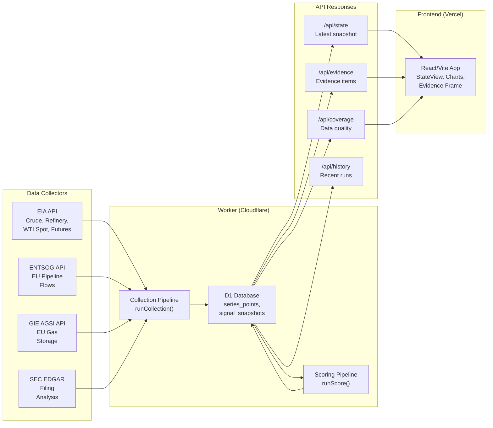
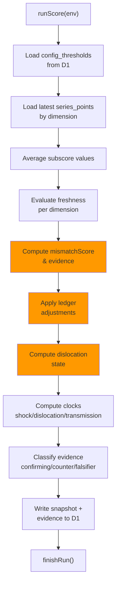
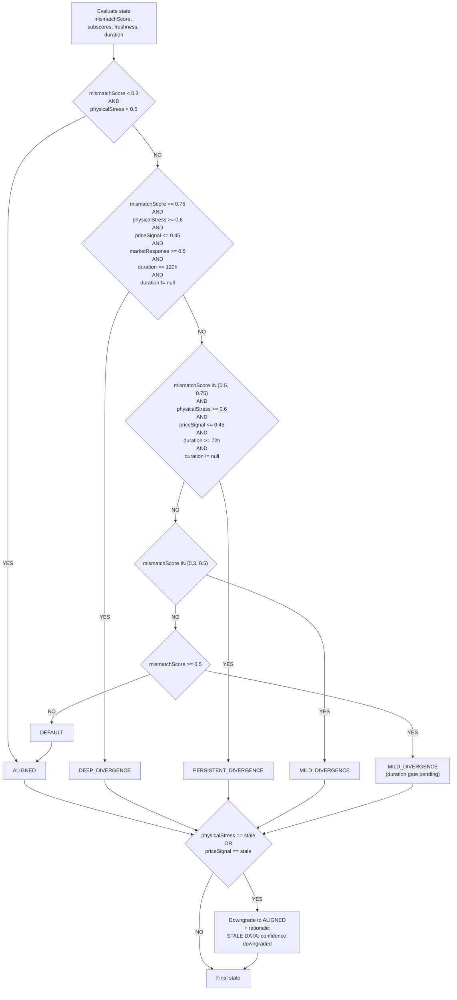
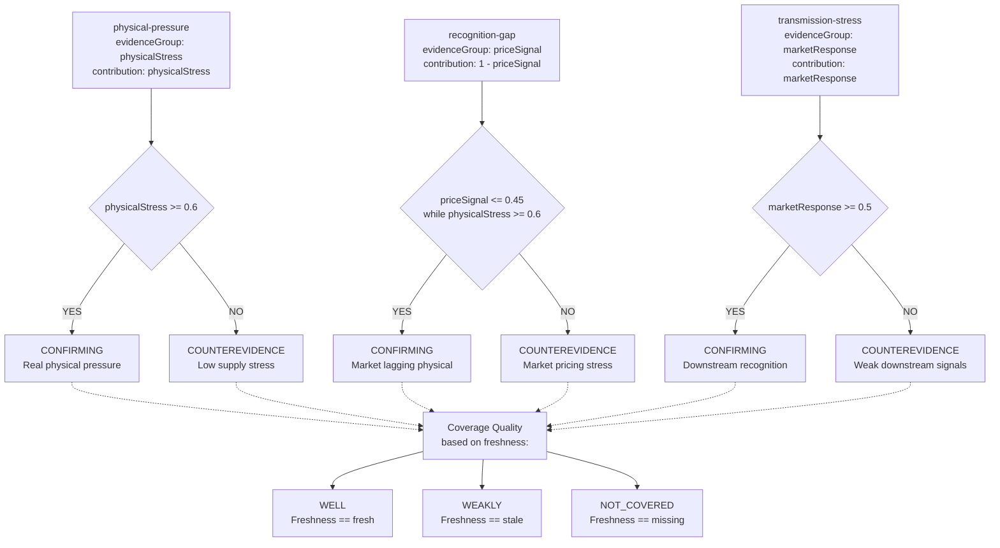

# CLAUDE.md

This file provides guidance to Claude Code (claude.ai/code) when working with code in this repository.

## Overview

Oil Shock is a low-cost energy dislocation state engine. It detects when physical energy constraints worsen faster than market pricing recognizes, exposing state snapshots and supporting evidence via API. The backend runs as a Cloudflare Worker with a D1 database; the frontend is a React/Vite app deployed on Vercel.

### System Architecture



## Monorepo Structure

pnpm workspaces with two packages: `worker` (Cloudflare Worker + API) and `app` (React frontend).

- `worker/src/core/` — scoring, freshness evaluation, normalization, ledger logic
- `worker/src/jobs/` — collection pipeline (EIA, Gas, SEC collectors) and scoring pipeline
- `worker/src/routes/` — HTTP route handlers (`/api/state`, `/api/evidence`, `/api/coverage`, `/api/ledger`, `/api/admin/run-poc`)
- `worker/src/db/` — type-safe D1 client wrapper
- `worker/src/lib/` — shared utilities (logging, CORS, error classes, HTTP helpers)
- `worker/src/types.ts` — all shared TypeScript interfaces
- `worker/src/env.ts` — Cloudflare environment bindings interface
- `db/migrations/` — D1 SQL migrations
- `scripts/` — CI validation scripts (replay determinism, docs completeness checks)
- `specs/` — planning artifacts (Ralph design, requirements)

## Commands

**Requires Node 24+, pnpm 10.33.0, and `corepack enable`.**

```bash
# Install dependencies
corepack pnpm install

# Local development
corepack pnpm db:migrate:local    # Apply D1 schema locally (run once after install)
corepack pnpm dev:worker          # Worker on port 8787 (wrangler dev)
corepack pnpm dev:web             # Frontend on port 5173 (vite)

# Tests
corepack pnpm test                         # All tests
corepack pnpm -C worker test               # Worker tests only
corepack pnpm -C app test                  # App tests only
corepack pnpm -C worker vitest run <pattern>  # Single worker test file
corepack pnpm -C app vitest run <pattern>     # Single app test file

# Type checking and build
corepack pnpm typecheck           # All packages
corepack pnpm build               # All packages

# Validation (used in CI)
corepack pnpm replay:validate     # Determinism check for scoring logic
corepack pnpm docs:check          # Verify documentation completeness

# Full CI preflight
corepack pnpm ci:preflight        # lint + typecheck + test + build
```

## Core Scoring Logic

The scoring pipeline (`worker/src/jobs/score.ts`) is the central domain logic. **All formula constants and gate thresholds are seeded into `config_thresholds` (see [Configurable Thresholds](#configurable-thresholds)) — never hardcode them in code.**

### Scoring Pipeline Flow



### Scoring Stages

1. **Collection** (`runCollection`): Fetches from EIA, ENTSOG/GIE, and SEC EDGAR; normalizes into `series_points` rows in D1. Each `series_key` is namespaced under one of three dimensions: `price_signal.*`, `physical_stress.*`, `market_response.*`. See [Data Sources & API Endpoints](#data-sources--api-endpoints) for the full mapping.

2. **Scoring** (`runScore`): Loads thresholds, reads the latest series points, evaluates freshness, then computes:

   - **Three subscores** (each clamped to `[0, 1]`):
     - `physicalStress` — average of: inventory_draw, refinery_utilization, eu_pipeline_flow, eu_gas_storage
     - `priceSignal` — average of: spot_wti (vs. 180-day p95), curve_slope (backwardation)
     - `marketResponse` — average of: crack_spread (3:2:1 z-scored), sec_impairment (filing analysis)
   
   - **Mismatch score formula**:
     ```
     mismatchScore = clamp01(
       physicalStress
       − priceSignal
       + marketResponse × thresholds.mismatchMarketResponseWeight
     )
     ```
     - High mismatch = physical stress exceeds price signal (market underpricing)
     - Low mismatch = price signal already high (market recognizes stress)
     - The `mismatchMarketResponseWeight` (default `0.15`) weights downstream recognition
   
   - **Coverage score** (applied separately, not to mismatchScore):
     ```
     coverageConfidence = clamp01(
       1
       − missingCount × 0.34       // each missing dimension
       − staleCount × 0.16         // each stale dimension
     )
     ```
     Coverage reflects data completeness, not signal strength.
   
   - **Dislocation state** — computed from mismatchScore, subscores, freshness, and duration (see [Dislocation State Computation](#dislocation-state-computation))
   
   - **Actionability state** (legacy `none` / `watch` / `actionable`): computed pre-ledger for backward compatibility. Ledger adjustments do **not** influence actionability — only `dislocationState`.
   
   - **Three clocks** (`worker/src/core/scoring/clocks.ts`):
     - `shockAge` — hours since first non-aligned state. `< 72h` → `"emerging"`, else `"chronic"`
     - `dislocationAge` — duration in current dislocation state (from `state_change_events`)
     - `transmissionAge` — hours since marketResponse signal first exceeded confirmation gate
   
   - **Evidence classification** per item (`confirming` / `counterevidence` / `falsifier`) — see [Evidence Classification](#evidence-classification)
   
   - **Evidence coverage** per item (`well` / `weakly` / `not_covered`) — depends on dimension freshness
   
   - **Ledger impact** (`worker/src/core/ledger/impact.ts`): 
     - For each active entry (not retired, not older than 30 days):
       - `increase`: `+0.10` to mismatchScore (clamped to [0,1])
       - `decrease`: `−0.10` to mismatchScore
     - Re-derive dislocationState after adjustment
   
   - Writes results to `signal_snapshots` and `run_evidence`

The API routes are **read-only** against precomputed snapshots — no computation happens at request time.

## Subscore Calculations

### Physical Stress Score
Averaged from four components:
```
physicalStress = avg([
  inventory_draw          // (5yr_avg - current) / 5yr_avg, clamped [0,1]
  refinery_utilization    // capacity_utilization / 100, clamped [0,1]
  eu_pipeline_flow        // 1 - (physical_flow / nomination), clamped [0,1]
  eu_gas_storage          // 1 - (gas_stored / working_volume), clamped [0,1]
])

// If only some exist, avg filters nulls and returns average of present ones
// High = supply constrained, storage depleted, pipelines stressed
```

### Price Signal Score
Averaged from two components:
```
priceSignal = avg([
  spot_wti_normalized,    // current_price / p95(180-day history), clamped [0,1]
  curve_slope             // rescaled from [-0.15, +0.15] to [0,1]
                          // backwardation (front > far) = high signal
])

// Curve slope rescaling: (slope + 0.15) / 0.3
// At -0.15 (strong contango): 0 (market expects price drop)
// At 0.00 (flat): 0.5 (neutral)  
// At +0.15 (strong backwardation): 1 (market expects price rise/stress)
```

### Market Response Score
Averaged from two components:
```
marketResponse = avg([
  crack_spread_zscore,    // z-score against 180-day baseline, rescaled [0,1]
  sec_impairment          // average filing impairment across 25 tracked companies
])

// Crack spread = (2·gas·42 + distillate·42 - 3·crude) / crude
// High = downstream processors taking margin pressure (response to oil stress)
// SEC impairment = 50% keyword_linkage + 50% negative_guidance_risk
// High = filings show oil cost concerns or negative guidance
```

### Averaging Logic (avgSafe)
```typescript
function avgSafe(values: (number | null)[]): number {
  const valid = values.filter(v => v !== null && Number.isFinite(v));
  if (valid.length === 0) return 0;  // all null → 0
  return clamp(valid.reduce((a,b) => a + b) / valid.length);
}
```
- Filters out null/undefined (missing data points)
- If one value exists, returns that value
- If multiple exist, returns their arithmetic mean
- Result clamped to [0, 1]

## Dislocation State Computation

`worker/src/core/scoring/state-labels.ts` evaluates regime rules in priority order. **All numeric thresholds come from `config_thresholds`** — the values shown below are current defaults.



**State Rules** (in priority order):

```
1. IF mismatchScore < 0.3 AND physicalStress < 0.5
   → ALIGNED

2. ELSE IF mismatchScore >= 0.75
           AND physicalStress >= 0.6
           AND priceSignal <= 0.45
           AND marketResponse >= 0.5
           AND durationHours >= 120 (5 days)
           AND durationHours != null
   → DEEP_DIVERGENCE

3. ELSE IF mismatchScore IN [0.5, 0.75)
           AND physicalStress >= 0.6
           AND priceSignal <= 0.45
           AND durationHours >= 72 (3 days)
           AND durationHours != null
   → PERSISTENT_DIVERGENCE

4. ELSE IF mismatchScore IN [0.3, 0.5)
   → MILD_DIVERGENCE

5. ELSE IF mismatchScore >= 0.5
   → MILD_DIVERGENCE (catch-all: duration gate not met or null)

6. Conservative downgrade:
   IF freshness.physicalStress == "stale"
   OR freshness.priceSignal == "stale"
   → Force to ALIGNED with "[STALE DATA: confidence downgraded]" in rationale
```

**Key Invariants:**
- `null` duration (first-ever snapshot) **never** advances to persistent/deep (see `null_duration_high_score` test fixture)
- Confirmation gates (physicalStress >= 0.6, priceSignal <= 0.45) prevent divergence states when confirmations are weak
- Stale data always downgrades to aligned, even if logic otherwise suggests divergence

**Critical invariant**: a `null` `durationHours` (first-ever snapshot, or no prior `state_change_events`) must **never** advance to `persistent_divergence` or `deep_divergence` — the `null`-duration check above is what prevents a cold-start jump to deep. The replay fixture `null_duration_high_score` enforces this.

The three clocks track temporal persistence:
- **Shock age** < `shockAgeThresholdHours` (default 72h) → `"emerging"`, else `"chronic"`.
- **Dislocation age** measures how long the current dislocation state has held.
- **Transmission age** measures how long the `marketResponse` signal has been elevated.

## Evidence Classification

Evidence items are classified based on how they support or refute the dislocation hypothesis. Logic in `worker/src/core/scoring/evidence-classifier.ts`:



**Classification Rules:**
- **physical-pressure**:
  - `physicalStress >= 0.6` → `confirming` (high supply stress)
  - Otherwise → `counterevidence` (low stress contradicts divergence thesis)

- **recognition-gap** (lagging market):
  - `priceSignal <= 0.45` while `physicalStress >= 0.6` → `confirming` (market underpricing)
  - Otherwise → `counterevidence` (prices already reflect stress)

- **transmission-stress** (downstream impact):
  - `marketResponse >= 0.5` → `confirming` (downstream sector recognizing stress)
  - Otherwise → `counterevidence` (weak downstream impact)

**Coverage Quality:**
- `WELL`: freshness == `fresh` (data ≤ 3 days for price, ≤ 8 days for physical/market)
- `WEAKLY`: freshness == `stale` (data older than windows)
- `NOT_COVERED`: freshness == `missing` (no data collected)

## Ledger Adjustments

Manual ledger entries in `impairment_ledger` table provide a way to adjust the mismatchScore based on external factors (analyst reports, regulatory changes, etc.). Logic in `worker/src/core/ledger/impact.ts`:

```
For each ledger entry:
  - Skip if retiredAt != null (entry explicitly retired)
  - Skip if createdAt > 30 days old (ledgerStaleThresholdDays)
  - If impactDirection == 'increase': adjustedScore += 0.10
  - If impactDirection == 'decrease': adjustedScore -= 0.10

adjustedScore = clamp(baseScore + sum(adjustments), [0, 1])

Re-derive dislocationState from adjustedScore instead of baseScore
```

**Default magnitude**: 0.10 per entry (configurable via `ledger_adjustment_magnitude`)

**Stale entries** (older than 30 days) are ignored unless explicitly reinstated.

## Data Sources & API Endpoints

All collectors live in `worker/src/jobs/collectors/`. Each collector emits `NormalizedPoint`s with a `seriesKey` namespaced under exactly one dimension (`price_signal.*`, `physical_stress.*`, `market_response.*`). The `observedAt` field comes from the upstream feed (EIA `period`, ENTSOG `periodFrom`, GIE `gasDayStart`, SEC `filingDate`) — never from the wall clock unless the upstream omits it (warning is logged in that case).

### EIA — `worker/src/jobs/collectors/eia.ts`

**Endpoint**: `https://api.eia.gov/v2/`  
**Auth**: `EIA_API_KEY` query parameter  
**Rate Limit**: SEC-recommended 10 req/s (configured at 8 req/s = 125ms between requests)  
**Retry Policy**: 1 retry with 100ms backoff (post-timeout fix)  
**Timeout**: 30 seconds per request

**Data Window**: Rolling window
- Daily series: `endDate = today`, `startDate = today − 60 days`
- Weekly series: `endDate = today`, `startDate = today − 26 weeks`
- **Critical**: Date window is computed fresh each collection run — **never hardcoded** (historic bug: fixed `2026-02-01 → 2026-04-18` window)

**Data Points Collected**:

| Series Key | Endpoint | Series IDs | Frequency | Normalization | Notes |
|---|---|---|---|---|---|
| `price_signal.spot_wti` | `petroleum/pri/spt/data` | `RWTC` | daily | `value / p95(180-day history)`, [0,1] | Falls back to `value/120` if no baseline |
| `price_signal.curve_slope` | `petroleum/pri/fut/data` | `RCLC1`, `RCLC12` | daily | `(front - far) / abs(front)` rescaled [-0.15,+0.15] → [0,1] | Backwardation (front>far) = high signal |
| `physical_stress.inventory_draw` | `petroleum/stoc/wstk/data` | `WCESTUS1` | weekly | `(5yr_avg - latest) / 5yr_avg`, [0,1] | US crude ex-SPR; falls back to prior-week delta |
| `physical_stress.refinery_utilization` | `petroleum/pnp/unc/data` | capacity utilization | monthly | `value / 100`, [0,1] | High utilization = high stress |
| `market_response.crack_spread` | `petroleum/pri/spt/data` | gasoline, distillate, crude | daily | 3:2:1 formula z-scored vs 180-day baseline, [0,1] | Refiner margin pressure |

**observedAt**: Extracted from EIA `period` field (e.g., `"2026-04-15"`). If missing, falls back to `nowIso` with warning logged.

**Failure Mode**: Returns `[]` (no points). Missing EIA data degrades `physicalStress` and `priceSignal` to lower confidence but does not halt scoring.

### Gas (ENTSOG + GIE AGSI+) — `worker/src/jobs/collectors/gas.ts`

#### ENTSOG (EU Pipeline Flows)

**Endpoint**: `https://transparency.entsog.eu/api/v1/operationaldatas`  
**Auth**: None  
**Rate Limit**: No explicit limit; 500ms delay between indicator requests  
**Retry Policy**: None (fail fast)  
**Timeout**: 15 seconds

**Data Window**: 30-day rolling  
**Indicators**: `Nomination`, `Physical Flow`, `Firm Available`, `Firm Technical`, `Firm Booked`  
**Output**: `physical_stress.eu_pipeline_flow`  
**Normalization**: `stress = 1 - (physical_flow / nomination)` aggregated across operators, [0,1]  
**observedAt**: From `periodFrom` field

**Key Detail**: Missing values do NOT emit default points (e.g., do not default to 0.5). Missing dimension correctly triggers `freshness == "missing"` and degrades coverage.

#### GIE AGSI+ (EU Gas Storage)

**Endpoint**: `https://agsi.gie.eu/api?type=eu`  
**Auth**: Header `x-key: <GIE_API_KEY>`  
**Rate Limit**: 1 req/s (rate limit errors trigger retry)  
**Retry Policy**: 1 retry with 100ms backoff  
**Timeout**: 15 seconds

**Output**: `physical_stress.eu_gas_storage`  
**Normalization**: `stress = 1 - (gasInStorage / workingGasVolume)`, [0,1]  
**Higher = More Depleted = More Physical Stress**

**observedAt**: From `gasDayStart` field

**Security**: `GIE_API_KEY` is environment secret — **never inline** (a previous version had key hardcoded; rotate out-of-band if exposed).

**Failure Mode**: Returns `[]`. Missing gas storage data degrades `physicalStress` but does not block scoring.

### SEC EDGAR — `worker/src/jobs/collectors/sec.ts`

**Endpoints**: 
1. `https://www.sec.gov/files/company_tickers.json` (ticker→CIK map)
2. `https://data.sec.gov/submissions/CIK{cik10}.json` (per-company filings list)
3. `https://www.sec.gov/Archives/edgar/data/{cikNum}/{accession}/{document}` (filing text)

**Auth**: None (public data)  
**Rate Limit**: SEC recommends 8-10 req/s; configured at 125ms = 8 req/s  
**Retry Policy**: 1 retry with 100ms backoff on all endpoints (post-timeout fix, commit e762a47)  
**Timeout**: 15 seconds per request

**User-Agent**: Required for SEC compliance; set to real contact string (handled in `worker/src/lib/http-client.ts`)

**Company Universe**: 25 tickers across 5 sectors:
- Airlines/Trucking/Logistics: `DAL UAL AAL FDX UPS JBHT`
- Chemicals/Plastics/Industrials: `DOW LYB EMN WLK DD`
- Retail/Consumer/Food: `WMT COST TGT KR`
- Utilities/Power/LNG: `DUK SO NEE SRE LNG`
- Oil Producers/Refiners: `XOM CVX COP MPC VLO`

**Collection Flow**:
```
1. GET company_tickers.json → build ticker→CIK map
   - Failure: return [] (series marked missing, coverage penalized)
   
2. For each ticker:
   GET submissions/{cik10}.json → recent filings list
   - Failure: skip ticker (log warning)
   
3. For up to 4 most recent 10-K / 10-Q / 8-K filings:
   GET filing document → strip HTML
   - Failure: skip filing (log warning)
   
4. Score each filing:
   - Keyword match: sector-specific keywords (fuel, jet fuel, feedstock, etc.)
     Word-boundary regex \b<keyword>\b (so "fuel" ≠ "refuel")
     Match present → hasOilLinkage = 1
     
   - Negative guidance patterns:
     "lowered guidance", "cut guidance", "withdrew guidance", "softer demand",
     "margin pressure", "higher fuel costs", etc.
     Balanced by positive: "raised guidance", "reaffirmed", "offset", "cost recovery"
     guidanceRisk = max(0, negCount - posCount)
   
   - impairmentScore = hasOilLinkage × 0.5 + guidanceRisk × 0.5

5. Average across all scored companies
   avgScore = sum(impairmentScores) / companiesScored
   
6. Emit single point:
   seriesKey: "market_response.sec_impairment"
   value: min(1, avgScore)
   observedAt: most recent filingDate (or nowIso if none parseable)
```

**Failure Modes**:
- Ticker map fetch fails → return `[]`, series marked `missing`
- Submission fetch fails for company → skip that company (log warning)
- Filing fetch fails → skip that filing (log warning)
- All companies have zero impairment → emit 0 (legitimate low signal)
- Timeout on any request → retry once with 100ms backoff; if still fails, continue with next item

**Data Lag**: SEC filings are 4-8 weeks old (quarterly/annual documents). High impairment scores indicate historical market realization; low scores may indicate:
- Recent stress not yet reflected in filings, OR
- Companies genuinely unaffected by oil stress, OR
- Negative guidance language not yet updated in most recent filings

**observedAt Timestamp**: Derived from most recent `filingDate` across all scored companies. If no companies have parseable dates, falls back to `nowIso` with warning.

### Freshness Evaluation — `worker/src/core/freshness/evaluate.ts`

Each dimension's most recent `observedAt` is compared to `Date.now()` and classified:

| Dimension | Fresh Window | Stale | Missing | Rationale |
|---|---|---|---|---|
| `physicalStress` | ≤ 8 days | > 8 days | no data | Weekly EIA stocks + monthly refinery + ENTSOG/GIE daily |
| `priceSignal` | ≤ 3 days | > 3 days | no data | Daily EIA spot/futures (most frequent) |
| `marketResponse` | ≤ 8 days | > 8 days | no data | Daily crack spread + periodic SEC filings |

```typescript
function evaluateRecency(observedAt: string | null, maxAgeDays: number): "fresh" | "stale" | "missing" {
  if (!observedAt) return "missing";
  const age = Date.now() - Date.parse(observedAt);
  return age <= maxAgeDays * 24 * 60 * 60 * 1000 ? "fresh" : "stale";
}
```

**Freshness Windows** are currently inlined in `evaluate.ts` (not yet promoted to `config_thresholds`). To tune:
1. Edit the `maxAgeDays` values in `evaluate.ts`
2. Update this section in CLAUDE.md
3. Update test fixtures if behavior changes
4. Run `corepack pnpm replay:validate` to ensure determinism

**Impact on Scoring**:
- Fresh data: full confidence in subscore
- Stale data: still used in averaging, but signals reduced confidence in evidence
- Missing data: treated as null in averaging, triggers coverage penalty
- Either critical dimension stale → entire state downgraded to ALIGNED

## Configurable Thresholds

All scoring constants live in `config_thresholds` (key/value rows). The TypeScript view is `ScoringThresholds` in `worker/src/types.ts`, loaded by `loadThresholds` in `worker/src/db/client.ts`. **Every key listed below is in the `required` tuple in `loadThresholds` — a missing seed row throws `MISSING_THRESHOLD` at startup.** This is intentional; see the "Data-seed migrations" landmine below.

After applying migrations, the table must contain **20 rows** (10 from `0004_config_thresholds.sql`, 10 from `0006_promote_scoring_constants.sql`).

### From `db/migrations/0004_config_thresholds.sql`

| Key | Default | Used by | Purpose |
|---|---|---|---|
| `state_aligned_threshold_max` | `0.3` | state-labels | upper bound for `aligned` |
| `state_mild_threshold_min` | `0.3` | state-labels | lower bound for `mild_divergence` |
| `state_mild_threshold_max` | `0.5` | state-labels | upper bound for `mild_divergence` |
| `state_persistent_threshold_min` | `0.5` | state-labels | lower bound for `persistent_divergence` |
| `state_persistent_threshold_max` | `0.75` | state-labels | upper bound for `persistent_divergence` |
| `state_deep_threshold_min` | `0.75` | state-labels | lower bound for `deep_divergence` |
| `shock_age_threshold_hours` | `72` | clocks | `< threshold` → `"emerging"`, else `"chronic"` |
| `dislocation_persistence_threshold_hours` | `72` | clocks (legacy) | retained for backward compatibility |
| `transmission_freshness_threshold_days` | `8` | clocks (legacy) | retained for backward compatibility |
| `ledger_adjustment_magnitude` | `0.1` | ledger/impact | per-entry `±` adjustment to score |

### From `db/migrations/0006_promote_scoring_constants.sql`

| Key | Default | Used by | Purpose |
|---|---|---|---|
| `mismatch_market_response_weight` | `0.15` | compute | weight on `marketResponse` in mismatch formula |
| `confirmation_physical_stress_min` | `0.6` | state-labels | confirmation gate for persistent/deep |
| `confirmation_price_signal_max` | `0.45` | state-labels | confirmation gate for persistent/deep |
| `confirmation_market_response_min` | `0.5` | state-labels | confirmation gate for deep only |
| `coverage_missing_penalty` | `0.34` | compute | per-missing-dimension penalty on coverage |
| `coverage_stale_penalty` | `0.16` | compute | per-stale-dimension penalty on coverage |
| `coverage_max_penalty` | `1.0` | compute | hard cap on coverage penalty |
| `state_deep_persistence_hours` | `120` | state-labels | minimum dwell time before `deep_divergence` (5 days) |
| `state_persistent_persistence_hours` | `72` | state-labels | minimum dwell time before `persistent_divergence` (3 days) |
| `ledger_stale_threshold_days` | `30` | ledger/impact | ledger entries older than this are ignored |

**To change a threshold**: write a new sequentially-numbered migration that does `INSERT OR REPLACE INTO config_thresholds (key, value) VALUES (...)`. Never edit `0004` or `0006` after they have been applied to any environment. After applying, re-run `corepack pnpm replay:validate` to confirm the new value still produces deterministic, expected behavior on all fixture windows.

## Key Conventions

- **snake_case** for all DB column names; **camelCase** for TypeScript identifiers; **SCREAMING_SNAKE_CASE** for constants.
- Errors: throw `AppError` (from `worker/src/lib/`) with an HTTP status and an error code string.
- Logging: structured JSON via the logger in `worker/src/lib/`, always include a `context` object.
- D1 queries: use the `env.DB.prepare(sql).bind(...params).run()` pattern directly; no ORM.
- CORS: allowlist-based — localhost, `*.vercel.app`, and the configured `PRODUCTION_ORIGIN`.
- No ESLint or Prettier — TypeScript strict mode (`noUncheckedIndexedAccess`, etc.) is the primary guardrail.

## Environment Variables

**Worker** (set in `wrangler.jsonc` or via Cloudflare dashboard):
- `APP_ENV`: `local` | `preview` | `production`
- `PRODUCTION_ORIGIN`: frontend origin for CORS

**Secrets** (never committed — inject via `wrangler secret put`):
- `EIA_API_KEY`: EIA v2 API key (https://www.eia.gov/opendata/)
- `GIE_API_KEY`: GIE AGSI+ API key (https://agsi.gie.eu/)

For local development, copy `worker/.dev.vars.example` to `worker/.dev.vars` and fill in real values. The `.dev.vars` file is gitignored.

**Frontend** (`.env` file in `app/`):
- `VITE_API_BASE_URL`: defaults to `http://127.0.0.1:8787` for local dev

## Database

D1 (SQLite). Schema is in `db/migrations/`. Key tables:
- `series_points` — raw time-series from collectors (indexed on `series_key, observed_at`)
- `signal_snapshots` — latest computed snapshot with mismatch score, dislocation state, subscores, clocks, ledger impact (indexed on `generated_at`)
- `state_change_events` — historical state transitions for computing clock ages (indexed on `generated_at`)
- `run_evidence` — evidence breakdown per scoring run with classification and coverage labels
- `impairment_ledger` — manually-tracked impairment entries (support retire/reinstate)
- `config_thresholds` — runtime-configurable scoring thresholds (state boundaries, temporal thresholds, ledger magnitude)

## Landmines

### Critical Issues

- **SEC collector timeout hang (RESOLVED, commit e762a47)**: Prior to April 22, 2026, the SEC collector used aggressive exponential backoff (2s, 4s, 8s) on retries. With ~50 SEC API calls per collection run, a single failure could accumulate 60+ minutes of backoff delays, exceeding Cloudflare's 90s wall time and hanging the frontend Recalculate button indefinitely.
  
  **Fix applied (commit e762a47)**:
  - Reduced retries: 3 → 1
  - Reduced backoff: 2000ms → 100ms
  - Rate limiting: maintained at 125ms (8 req/s, SEC-recommended)
  - Impact: Single retry provides transient failure resilience; total failure time ≤ 15 seconds
  - Graceful degradation: SEC returns `[]` on total failure, series marked `missing`, other collectors proceed
  
  **Monitoring**: If collection times exceed 30 seconds, check worker logs for SEC timeout patterns. If stuck `running` runs reappear, verify SEC endpoint status.

- **SEC data freshness lag**: SEC filings are 4-8 weeks old (quarterly/annual documents). A low `market_response` score (e.g., 7.5%) does **not** mean the collector is broken — it indicates that tracked companies haven't yet filed documents mentioning oil/fuel stress. Monitor `observedAt` timestamp of latest `market_response.sec_impairment` series point. If > 8 days old, the dimension is `stale` and triggers state downgrade. If missing entirely, SEC collection failed and coverage is penalized.

- **Vercel output directory**: Vercel defaults to looking for a `public` directory. This repo builds to `app/dist`. The `vercel.json` at the root sets `outputDirectory` and `buildCommand` correctly — don't remove it or change the output path without updating `vercel.json` to match.

### Database Integrity

- **D1 migrations must be applied via Wrangler, never ad-hoc**: The production D1 database (`energy_dislocation`, id `9db64b68-6ffc-4be2-a2c6-667691a5801f`) previously had migrations applied out of order (0004/0005 applied, 0002/0003 skipped), which surfaced as `D1_ERROR: no such column: evidence_classification` at runtime. Ad-hoc SQL execution bypasses Wrangler's `d1_migrations` tracking table, leaving the database in an inconsistent state with no audit trail.

  **Required workflow for any schema change:**

  1. **Author** the migration as a new, sequentially numbered file in `db/migrations/` (e.g., `0007_*.sql`). Never edit an existing migration that has been applied anywhere.
  2. **Apply locally first**: `corepack pnpm db:migrate:local` — confirm the change works against the local D1.
  3. **Run the full test suite** (`corepack pnpm test`) and `corepack pnpm replay:validate` before touching remote.
  4. **Apply to remote via Wrangler**, never via the Cloudflare dashboard, MCP SQL tool, or raw API:
     ```bash
     corepack pnpm wrangler d1 migrations apply energy_dislocation --remote
     ```
     This is the only path that updates the `d1_migrations` tracking table.
  5. **Verify** applied migrations on the remote:
     ```bash
     corepack pnpm wrangler d1 migrations list energy_dislocation --remote
     ```
     The output must list every file in `db/migrations/`. If any are missing, stop and investigate before deploying worker code that depends on them.
  6. **Deploy the worker only after** the migration is confirmed applied on remote. Schema changes lead code: migration first, then worker deploy.

  **If you find the remote DB in an inconsistent state** (missing `d1_migrations` table, or schema drift from the migration files): do not patch columns manually. Reconcile by backfilling the `d1_migrations` table to reflect what's actually applied, then run `wrangler d1 migrations apply --remote` to apply the true-missing ones. Document the reconciliation in the commit message.

- **Check for `d1_migrations` before any deploy that depends on a migration**: The tracking table's absence is silent — the app boots, tables exist, but Wrangler has no state and will attempt to re-run all migrations from scratch on the next `apply`. Verify it exists before touching remote:
  ```sql
  SELECT name FROM sqlite_master WHERE name = 'd1_migrations';
  ```
  If missing, all prior migrations were applied ad-hoc. Reconcile first (see above) before running any further `wrangler d1 migrations apply`.

- **Data-seed migrations (INSERT-only) are invisible when skipped**: Migrations that only contain `INSERT` statements (e.g. `0004_config_thresholds.sql`) leave no schema evidence if skipped — the table exists, it's just empty. The scoring pipeline will boot and collect data normally, but `runScore` will throw `MISSING_THRESHOLD` on the very first call to `loadThresholds`, which is invoked *outside* the try-catch in `score.ts`. This means `finishRun` is never called, runs stay stuck at `status = 'running'` forever, no new snapshots are written, and the Recalculate button on the frontend will spin until the 90-second poll timeout with no visible error. After any migration apply, verify config data is present:
  ```sql
  SELECT COUNT(*) FROM config_thresholds; -- must return 20 (10 from 0004 + 10 from 0006)
  ```

- **Stuck `running` runs mean the error is before the try-catch in `score.ts`**: If `SELECT status, COUNT(*) FROM runs GROUP BY status` shows runs permanently stuck at `running` with no `failed` rows, the error is thrown before the try block — not caught, `finishRun` never called. Check `config_thresholds` row count first. Do not add new `INSERT` calls or schema changes to diagnose; fix the root cause (missing seed data or missing migration).

- **`ALTER TABLE` DEFAULT values on `signal_snapshots` create misleading zero-data rows**: When columns are added to `signal_snapshots` via `ALTER TABLE ... ADD COLUMN ... DEFAULT '{"physical":0,...}'`, all existing rows silently receive zeros for those fields. This produces snapshots where `subscores_json` shows all zeros while `mismatch_score` is non-zero — which looks like a scoring bug but is actually stale rows with default values. Use `DEFAULT 'null'` or a distinguishable sentinel instead of numeric defaults so pre-migration rows are identifiable as such.

### Cloudflare Worker

- **`POST /api/admin/run-poc` must use `ctx.waitUntil`, never `await`**: The collection + scoring pipeline takes longer than Cloudflare's CPU budget for a single request. If the handler uses `await runCollection(env); await runScore(env)`, Cloudflare will kill the request mid-execution, no snapshot is written, and the frontend Recalculate button spins indefinitely. The handler must return immediately via `ctx.waitUntil(runCollection(env).then(() => runScore(env)))`. The `fetch` handler signature must include `ctx: ExecutionContext` as the third parameter.

### Frontend/API Contract

- **Frontend and worker each define their own `Subscores` / `FreshnessSummary` interfaces**: `app/src/components/StateView.tsx` and `worker/src/types.ts` live in separate packages (`app/` and `worker/`), and TypeScript has no cross-workspace coupling by default. A rename on one side (e.g. `physical` → `physicalStress`) compiles cleanly on both sides in isolation, but produces a runtime `undefined → 0%` mismatch in the UI that **looks exactly like a scoring bug**. The guardrail is `app/src/types/api-contract.ts`, which imports the worker's types via relative path and asserts structural equality — any drift on either side now fails `corepack pnpm typecheck`. The complementary runtime guard is `worker/test/routes/state.test.ts`, which asserts the `/api/state` response has exactly the expected key set. Never add a shape-mapping shim in `normalizeStatePayload` to paper over drift — fix the types so both guards pass.

- **`signal_snapshots.subscores_json` schema changes strand old rows**: When the subscore key set is renamed (e.g. PR #28's `physical/recognition/transmission` → `physicalStress/priceSignal/marketResponse`), historical `signal_snapshots` rows still hold the **old** JSON shape. `/api/state` returns the latest row verbatim, and the frontend renders `undefined → 0%` for every renamed key. The symptom is "one subscore bar has a real value, the others are all 0%" — indistinguishable from a scoring bug. On any such rename: (a) accept that only post-migration snapshots are correct and block production deploy until a fresh snapshot exists, or (b) ship a migration that rewrites `subscores_json` on existing rows. **Do NOT add backward-compat fallbacks in `state.ts` or the frontend** — they become permanent cruft. The CI post-deploy smoke check in `.github/workflows/ci.yml` (`Smoke-check preview /api/state subscore shape`) catches shape drift on the preview worker before production deploy.

- **Recalculate button silent timeouts hide real failures**: `app/src/App.tsx`'s recalc flow POSTs `/api/admin/run-poc` and polls `/api/state` for 90s. When the worker is actually broken (e.g. `loadThresholds` throwing pre-try-catch, D1 outage, pre-rename stale snapshot never refreshing), the UI goes from spinner → back to idle with **no visible error** — indistinguishable from "the user tapped and waited long enough." The fix is a `recalcError` state that is set on POST non-2xx, POST network error, or the 90s poll deadline, and surfaced as a dismissable banner. Two tests lock this behavior in (`App.test.tsx`: `surfaces a visible error when Recalculate POST returns 500` and `surfaces a timeout error when the new snapshot never arrives within the deadline`). When these tests go red, **do NOT** loosen them — a silent recalc is the symptom that makes every other bug on this list harder to diagnose.

- **Partial config_thresholds seed = silent pre-catch crash**: The `0004_config_thresholds.sql` and `0006_promote_scoring_constants.sql` migrations together seed 20 rows. If only `0004` is applied (10 rows), the database table exists with data, so local tests may pass. But `loadThresholds()` in `worker/src/db/client.ts` requires a specific set of keys; if `0006` is missing, the `required` tuple at the top of `loadThresholds` will fail on the first missing key, throwing `MISSING_THRESHOLD` before the try-catch in `score.ts:54`. This leaves runs stuck at `status = 'running'`, no new snapshots written, and the Recalculate button times out with no error message. The symptom is "recalc always times out" with an empty `/api/state` or stale snapshot. **Always verify post-migration that `SELECT COUNT(*) FROM config_thresholds` returns exactly 20**, not 10. If stuck runs exist with old timestamps, manually insert the missing `0006` rows into the database to unblock; see Landmine #3 above for the INSERT statement.

- **Subscores key drift between `compute.ts` output and stale `signal_snapshots` rows**: The scoring code generates subscores with keys `physicalStress`, `priceSignal`, `marketResponse` (set at `compute.ts:83-87`). If a prior version of the code used different keys (`physical`, `recognition`, `transmission`), historical `signal_snapshots` rows retain the old shape. The `/api/state` route returns the latest row verbatim; if the latest row is old with wrong keys, the frontend reads `subscores.physicalStress` and gets `undefined`, rendering as 0%. This looks exactly like a scoring bug (subscores all zero) but is actually a schema contract mismatch between old database rows and current code expectations. **On any subscore key rename**: (a) never add backward-compat shims in the frontend or `state.ts` route to map old keys to new ones — they become permanent cruft, and (b) block the production deploy until a fresh snapshot has been generated with the new keys (ensuring `/api/state` returns the correct shape). The guardrail is `app/src/types/api-contract.ts`, which imports `Subscores` from the worker and asserts structural equality; typecheck failure catches any divergence. After a key rename deploy, the Recalculate button **must be clicked at least once** to write a fresh snapshot before unblocking user traffic, otherwise users see stale wrong-keyed data. Smoke test in CI (`Smoke-check preview /api/state subscore shape`) catches this; if it fails, the preview deploy is correct but a fresh snapshot is needed before promoting to production.

## Testing Patterns

- Worker tests use an in-memory D1 mock (`worker/test/helpers/fake-d1.ts`).
- App tests use `@testing-library/react` with jest-dom matchers (setup in `app/src/test/setup.ts`).
- `scripts/replay-validate.ts` runs the **real scoring engine** (imports `computeSnapshot`, `applyLedgerAdjustments`, `computeDislocationState` from `worker/src/core/scoring/`) against fixture inputs in `worker/test/fixtures/replay-windows.json`, and asserts deterministic output across two identical runs. Update fixtures when intentionally changing scoring behavior. Each fixture must specify both `expectedDislocationState` and `expectedActionabilityState`. Critical fixture `null_duration_high_score` enforces the cold-start guard (high score with `durationHours = null` must NOT advance to `deep_divergence`).
