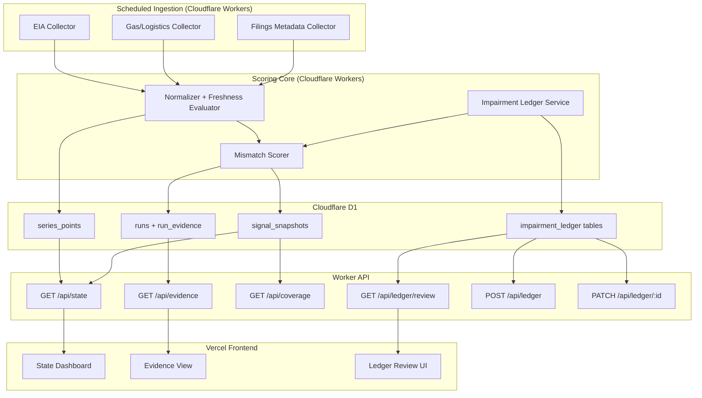
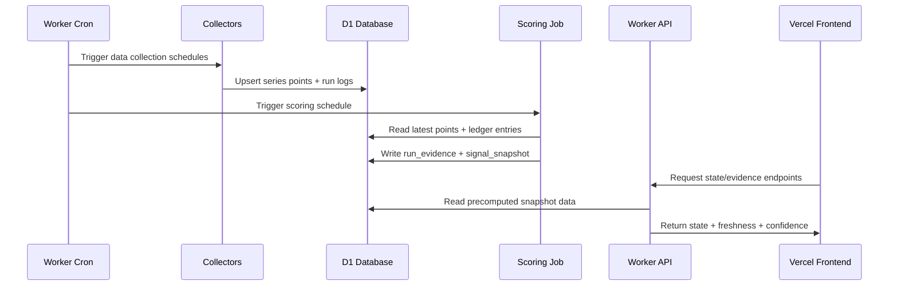

# Design: Oil Shock MVP

## Overview

The MVP is a scheduled state engine that ingests public energy-market signals, computes a mismatch score from independent feature groups, and serves precomputed snapshots to a lightweight frontend. Cloudflare Workers and D1 provide low-cost backend execution and storage; Vercel hosts the analyst-facing UI. The design prioritizes deterministic scoring, auditability, and operational simplicity over model complexity.

## Architecture

### Component Diagram



### Components

#### Ingestion Jobs
**Purpose**: Pull public upstream data and store normalized points.
**Responsibilities**:
- Schedule and run source-specific collectors.
- Validate source payload shape and timestamps.
- Write normalized values to `series_points`.
- Record run metadata and failures in `runs`.

#### Normalizer + Freshness Evaluator
**Purpose**: Convert raw source records into comparable feature values and freshness tags.
**Responsibilities**:
- Apply source-specific transforms and units normalization.
- Label each feature with freshness status and release lag.
- Mark incomplete coverage for downstream confidence scoring.

#### Mismatch Scorer
**Purpose**: Compute `mismatch_score` and `actionability_state`.
**Responsibilities**:
- Build independent sub-scores: physical pressure, market recognition, transmission.
- Enforce cross-confirmation rule before `actionable`.
- Persist one coherent snapshot per scoring run.

#### Ledger Service
**Purpose**: Maintain analyst-curated impairment assumptions and review lifecycle.
**Responsibilities**:
- CRUD-like maintenance endpoints for ledger entries.
- Track review cadence, staleness, and retire status.
- Expose review queue for operational upkeep.

#### API Layer
**Purpose**: Serve precomputed state and evidence to frontend clients.
**Responsibilities**:
- Return stable response contracts from snapshot tables.
- Include `generated_at`, `source_freshness`, and `coverage_confidence`.
- Enforce CORS for local, preview, and production origins only.

#### Frontend
**Purpose**: Present state, evidence, and ledger review workflows.
**Responsibilities**:
- Render current state card and confidence indicators.
- Surface evidence groups and source freshness.
- Provide maintainers a ledger review/edit experience.

### Data Flow



1. Scheduled collectors ingest and normalize public source data into D1.
2. Scheduled scoring computes one snapshot using fresh data and ledger adjustments.
3. Frontend reads only API-served snapshot/evidence views, never raw source pulls.

## Technical Decisions

| Decision | Options Considered | Choice | Rationale |
|----------|-------------------|--------|-----------|
| Backend runtime | Node server, serverless functions, Cloudflare Workers | Cloudflare Workers | Low ops overhead, native cron triggers, edge-friendly API serving |
| Primary storage | Postgres, SQLite local, Cloudflare D1 | Cloudflare D1 | Fits low-write MVP, simple cost profile, native Worker binding |
| Frontend host | Cloudflare Pages, Vercel, self-host VM | Vercel | Strong preview workflow and straightforward frontend deploy ergonomics |
| Scoring approach v1 | ML model, heuristic rules, hybrid | Heuristic rules | Transparent behavior, easier debugging, safer early calibration |
| API compute mode | On-demand scoring, precomputed snapshots | Precomputed snapshots | Predictable latency and reproducibility |

## File Structure

| File | Action | Purpose |
|------|--------|---------|
| `wrangler.jsonc` | Create | Worker config, D1 bindings, cron triggers, env sections |
| `worker/src/index.ts` | Create | API routing and request handling entrypoint |
| `worker/src/jobs/collectors/*.ts` | Create | Source-specific data collectors |
| `worker/src/jobs/score.ts` | Create | Snapshot scoring orchestration |
| `worker/src/core/scoring/*.ts` | Create | Sub-score and actionability logic |
| `worker/src/core/freshness/*.ts` | Create | Freshness and coverage calculations |
| `worker/src/core/ledger/*.ts` | Create | Ledger review and update services |
| `worker/src/db/*.ts` | Create | D1 query helpers and transaction boundaries |
| `db/migrations/*.sql` | Create | Schema creation and evolution |
| `app/src/pages/*.tsx` | Create | Dashboard, evidence, and ledger screens |
| `app/src/api/client.ts` | Create | Typed API client for Worker endpoints |
| `.github/workflows/ci.yml` | Create | Lint/typecheck/tests/replay checks |

## Interfaces

```typescript
export type ActionabilityState = "none" | "watch" | "actionable";

export interface FreshnessSummary {
  physical: "fresh" | "stale" | "missing";
  recognition: "fresh" | "stale" | "missing";
  transmission: "fresh" | "stale" | "missing";
}

export interface StateSnapshot {
  generated_at: string;
  mismatch_score: number;
  actionability_state: ActionabilityState;
  coverage_confidence: number;
  source_freshness: FreshnessSummary;
  evidence_ids: string[];
}

export interface LedgerEntryInput {
  key: string;
  rationale: string;
  impact_direction: "increase" | "decrease";
  review_due_at: string;
}
```

## Error Handling

| Error Scenario | Handling Strategy | User Impact |
|----------------|-------------------|-------------|
| Upstream source unavailable | Mark run failed with source code + reason; keep last valid snapshot | UI remains available with stale freshness flags |
| Partial source data | Degrade confidence and block `actionable` promotion | User sees lower confidence and explicit coverage warning |
| D1 write failure during scoring | Abort snapshot commit and log run failure atomically | No partial snapshot returned |
| Invalid ledger update payload | Return 400 with field-level validation errors | Maintainer can correct input and retry |

## Edge Cases

- **Freshness mismatch between groups**: score may compute, but `actionable` is disallowed when required groups are stale/missing.
- **Weekend/holiday delayed releases**: freshness windows account for known publication cadence and delays.
- **Contradictory evidence**: include counterevidence entries and reduce confidence even if raw mismatch score is high.
- **No newly ingested data**: scoring run may reuse last points with explicit stale status and run note.

## Dependencies

| Package | Version | Purpose |
|---------|---------|---------|
| `wrangler` | latest stable | Worker and D1 development/deployment |
| `typescript` | latest stable | Type-safe backend/frontend implementation |
| `zod` | latest stable | Runtime validation for API and ingest payloads |
| `vitest` | latest stable | Unit and integration testing |
| `react` | latest stable | Frontend UI framework |

## Security Considerations

- Keep all upstream keys/secrets in Worker secrets; do not place secrets in frontend env vars.
- Restrict CORS origins to local dev, Vercel preview, and production domain.
- Include request IDs and structured logs for traceability without leaking sensitive internals.
- Validate all ledger write inputs and enforce strict schema checks at API boundaries.

## Performance Considerations

- Serve read endpoints from precomputed snapshots to minimize response latency.
- Index D1 by `(series_key, observed_at)` and snapshot retrieval keys.
- Keep evidence payloads paginated or bounded to avoid oversized responses.
- Use cache headers for read-only endpoints where appropriate.

## Test Strategy

### Unit Tests
- Freshness policy evaluators and release-lag guards.
- Sub-score computation and actionability gating logic.
- Ledger validation and review-due calculations.
- Mock requirements: upstream source responses and D1 query layer.

### Integration Tests
- Collector -> D1 write flow for representative source payloads.
- Scoring run writes coherent `runs`, `run_evidence`, and `signal_snapshots`.
- API contract tests for `/api/state`, `/api/evidence`, `/api/coverage`, ledger endpoints.

### E2E Tests (if UI)
- Dashboard renders state/confidence/freshness with API fixture responses.
- Evidence page shows grouped support and counterevidence.
- Ledger review/edit flow updates and reflects entry status.

## Existing Patterns to Follow

Based on codebase analysis:
- No implementation patterns exist yet; establish consistent TypeScript module boundaries from the start.
- Keep all schema changes migration-driven and all API shapes explicitly typed.
